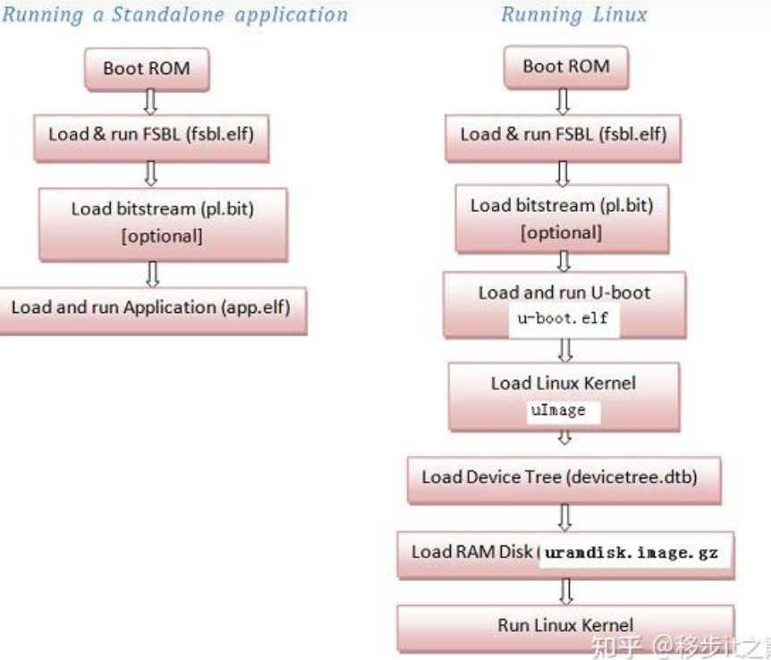

## 前置知识

### zynq启动流程 （UG585，第六章）



### BootRom

BootRom为一块只读存储器，里面程序一般出厂前或者流片前写死的，它主要负责**从外部存储设备中读取启动镜像**。（Ps：部分开发板引入了**引脚启动机制**，通过拨码开关，控制引导镜像的存储介质，**BootRom也会根据引脚状态确定要引导镜像的位置**）

BootRom从外部存储设备读取启动镜像后，通常将其加载到OCM中。

BootRom支持文件系统访问，支持FAT32，FAT16文件系统


#### BootROM负责：

1. 上电复位以后，PS端即开始进行配置。在不使用JTAG的情况下，ARM将在片上的BootROM中开 始执行代码。BootROM中的代码对NAND、NOR、Quad-SPI、SD与PCAP的基本外设控制器进行 初始化，使得ARM核可以访问、使用这些外设。（而DDR等其他外设将在阶段1或者之后进行初始 化。） 

2. BootROM读取MIO[2..8]的引脚设置来确定启动设备，将选定设备的头192Kbyte内容，也就是 FSBL，复制到OCM中，并将控制权交给FSBL。 FSBL启动时可以使用整块256Kb的OCM，当FSBL开始运行后，器件就正式由由用户控制了。 

#### 对于SD卡启动流程


#### 对于QSPI启动流程

后续补充

### FSBL

FSBL负责： 

1.  根据Vivado中的配置，完成PS端的初始化。运行PS_init函数，配置DDR以及其他配置

2.  使用比特流文件对PL进行配置 
3.  加载第二阶段引导程序（SSBL）或者裸跑程序（直接在ARM上运行无操作系统程序）到内存空 间。
4.   跳转执行SSBL（uboot)或者裸跑程序。


### BOOT.bin

此文件是FSBL+fpga.bit文件合成的


### uboot

一段裸机程序，主要作用是启动Linux，uboot根据环境变量配置从非易失性存储器或者网络将Linux内核镜像，设备树加载到内存中启动Linux内核，同时将配置的内核参数传递给内核，内核参数包含init程序位置。

### rootfs

**根文件系统**是Linux操作系统启动时所挂载的**第一个文件系统**。你可以把它想象成一棵树的根，所有的其他文件系统都从它这里延伸出去。

**rootfs**包含了系统启动所必需的**所有关键文件**，比如：

- **内核代码映像文件**：这是Linux内核的二进制文件，是系统的核心。
- **初始化脚本**：这些脚本在系统启动时执行，负责初始化系统各个组件。
- **设备文件**：代表系统中的硬件设备，如硬盘、网卡等。
- **库文件**：程序运行时所依赖的函数库。
- **系统配置文件**：配置系统的各种参数。

Linux启动时会找到init文件（可以是shell脚本或者就是可执行文件），运行此文件。

## 非petaLinux 环境制作Linux（基于buildroot)

1. 创建vivado工程，vitis裸机调试

2. 导出设备树
3. 编译uboot
4. 制作BOOT.bin
5. 编译Linux内核
6. 使用buildroot制作跟文件系统
7. 制作SD卡

### 导出设备树

首先下载device-tree-xlnx
https://github.com/Xilinx/device-tree-xlnx/tags
添加到vitis


先点击apply 然后点击apply and close

根据需求，添加自己的设备相关的配置

### 编译uboot

参考资料：

1. [U-boot - Xilinx Wiki - Confluence](https://xilinx-wiki.atlassian.net/wiki/spaces/A/pages/18842223/U-boot)

2. [Build U-Boot - Xilinx Wiki - Confluence](https://xilinx-wiki.atlassian.net/wiki/spaces/A/pages/18841973/Build+U-Boot)

首先在xilinx github下载与vivado版本一致的uboot：[Tags · Xilinx/u-boot-xlnx](https://github.com/Xilinx/u-boot-xlnx/tags)

解压后将修改的设备树上传到u-boot目录/arch/arm/dts文件夹下

 **需要在dts目录的Makefile文件添加自己的设备树文件 **，否则后续找不到DTB文件


先定义两个环境变量

```shell
export CROSS_COMPILE=arm-linux-gnueabihf-
export ARCH=arm
```

指定配置并编译

```shell
make distclean
make xilinx_zynq_virt_defconfig
export DEVICE_TREE="riguke-7020"
make
```

device tree can be found under `arch/arm/dts/` with the name `riguke-7020.dts`

可以自己手动编译DTB文件

[编译设备树 - tycoon3 - 博客园](https://www.cnblogs.com/dream397/p/15572985.html)

[Build Device Tree Blob - Xilinx Wiki - Confluence](https://xilinx-wiki.atlassian.net/wiki/spaces/A/pages/18842279/Build+Device+Tree+Blob)

### 制作BOOT.bin文件

利用vitis制作bootimage，通过fsbl.elf,fpga.bit,uboot.elf生成BOOT.bin文件

### Linux内核
1.下载github linux-xlnx。选择一个版本下载即可

[Tags · Xilinx/linux-xlnx](https://github.com/Xilinx/linux-xlnx/tags)

```shell
wget https://github.com/Xilinx/linux-xlnx/archive/refs/tags/xlnx_rebase_v6.1_LTS_2023.1_merge_6.1.70.tar.gz 
tar -xvf xlnx_rebase_v6.1_LTS_2023.1_merge_6.1.70.tar.gz
```

因为xilinx 提供的Linux内核的设备树直接通过uboot传递，所以采用统一的编译方式，不需要自己编写配置文件。对于zynq7000系列一下命令生成uImage镜像

```bash
#配置
make ARCH=arm xilinx_zynq_defconfig
make ARCH=arm menuconfig
#编译
make ARCH=arm CROSS_COMPILE=arm-linux-gnueabihf- -j12 UIMAGE_LOADADDR=0x8000 uImage
```


### 利用buildroot制作最小的跟文件系统

参考野火或者正点原子教程

到处`rootfs.ext2`文件

### 制作SD卡

利用Linux制作

通过fdisk命令创建两个分区，第一个分区fat格式，第二个分区ext4格式

```shell
sudo fdisk /dev/sdc

sudo mkfs.fat /dev/sdc1
sudo mkfs.ext4 /dev/sdc2
```

将BOOT.bin ，u-boot.dtb ,uImage拷贝到fat分区

使用`dd`命令将`rootfs.ext2`刷入到第二个分区

```shell
sudo dd if=rootfs.ext2 of=/dev/sdc2 bs=512 conv=sync status=progress
```

制作完成

### 启动和调试

插入sd卡上电启动后大概率卡死在uboot命令行，因为xilinx-uboot默认的`uboot bootcmd`找不到内核和设备树，所以修改uboot的bootcmd和bootargs（如果bootarg在设备树chosen节点正确设定了，uboot命令行里修改）

```shell
setenv bootcmd 'fatload mmc 0 ${kernel_addr_r} uImage; fatload mmc 0 ${fdt_addr_r} u-boot.dtb; bootm ${kernel_addr_r} - ${fdt_addr_r}'
setenv bootargs earlycon,console=ttyPS0,115200,rootfstype=ext4 root=/dev/mmcblk0p2 rw
boot
```

#### uboot配置和命令行的使用

[How to configure U-Boot for your board - stm32mpu](https://wiki.stmicroelectronics.cn/stm32mpu/wiki/How_to_configure_U-Boot_for_your_board)

##### 获取帮助

1.help

2.bdinfo:获取板子信息

##### mmc相关的命令

- **mmcinfo：** 显示MMC设备的信息。
- **mmcdev：** 选择一个MMC设备。
- **mmcread：** 从MMC设备读取数据。
- **mmcdump：** 将MMC设备的内容转储到串口。

##### FAT文件系统相关的命令

1. **fatinfo**

- **功能：** 查询指定MMC分区的文件系统信息。

- 格式：

  ```
  fatinfo <interface> [<dev[:part]>]
  ```

  - `interface`：接口，通常为`mmc`。
  - `dev`：设备号。
  - `part`：分区号。

- **示例：** `fatinfo mmc 0:1`  # 查询第一个MMC设备的第一个分区的信息

2. **fatls**

- **功能：** 列出FAT格式设备的目录和文件信息。
- **格式：** `fatls <interface> [<dev[:part]>] [directory]`
- **示例：** `fatls mmc 0:1 /boot`  # 列出第一个MMC设备的第一个分区中/boot目录下的文件

3. **fstype**

- **功能：** 查看MMC设备分区的文件系统格式。
- **格式：** `fstype <interface> <dev>:<part>`
- **示例：** `fstype mmc 0:1`  # 查看第一个MMC设备的第一个分区的文件系统类型

4. **fatload**

- **功能：** 从FAT文件系统加载文件到内存。

- 格式：

  ```
  fatload <interface> <dev[:part]> <addr> <filename>
  ```

  - `addr`：内存加载地址。
  - `filename`：要加载的文件名。

- **示例：** `fatload mmc 0:1 0x80008000 u-boot.img`  # 从MMC的第一个分区加载u-boot.img到内存地址0x80008000

5. **fatwrite**

- **功能：** 将内存中的数据写入FAT文件系统。

- 格式：

  ```
  fatwrite <interface> <dev[:part]> <filename> <addr> <bytes>
  ```

  - `bytes`：要写入的字节数。

- **示例：** `fatwrite mmc 0:1 u-boot.img 0x80008000 200000`  # 将内存地址0x80008000开始的200000字节数据写入MMC的第一个分区，文件名u-boot.img

**使用场景**

- **加载内核镜像：** 使用`fatload`命令将内核镜像从FAT文件系统加载到内存，然后使用`bootm`命令跳转到内核。
- **更新配置文件：** 使用`fatwrite`命令将修改后的配置文件写入FAT文件系统。
- **备份数据：** 使用`mmcread`命令将MMC设备中的数据读取到内存，然后保存到其他存储介质。

##### 启动内核指令

bootm 启动uImage内核镜像

bootz  启动zImage内核镜像

boot 运行bootcmd环境变量

##### 环境变量

uboot会保存环境变量，uboot启动后首先从外部存储读取环境变量。

1. **print或者printenv：**

   打印uboot的当前的环境变量， printenv 可以单独查看一个环境变量，比如printenv soc

2. **setenv**

添加/设置/删除环境变量

setenv 换将变量名 变量值

删除环境变量： setenv 环境变量名 

3. **saveenv**

将uboot环境变量更新到外部存储

4. **env**

   命令合集：包含了环境变量相关的所有命令

